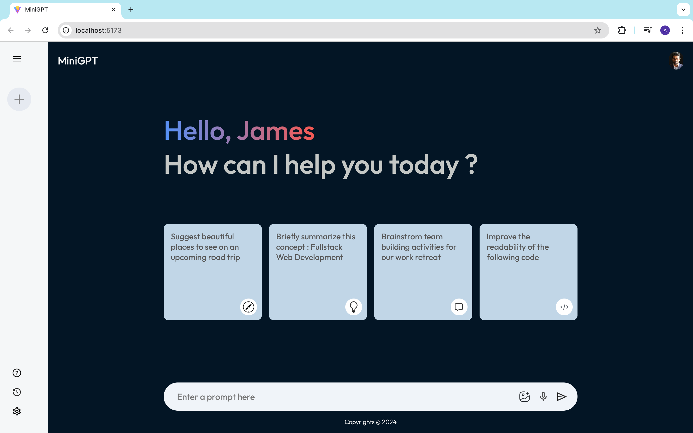
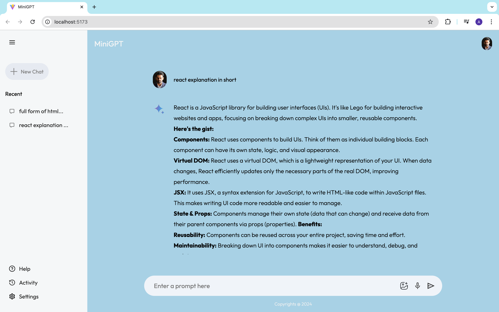

# Mini GPT

Using React i created a this app , it similar kind of chatGPT version and used Gemini API key to fetch the data that whatever the user is typing in the input text = "Enter a prompt here" 

Once you Click on the send icon button then the data is fetching from the gemini API server.

